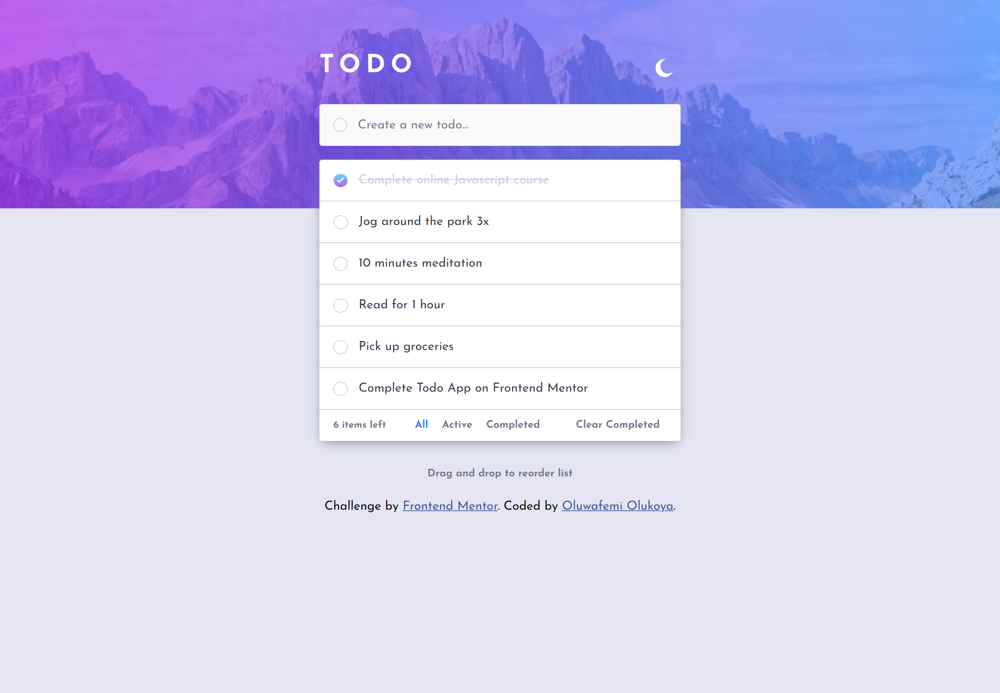

# Frontend Mentor - Todo app solution

This is a solution to the [Todo app challenge on Frontend Mentor](https://www.frontendmentor.io/challenges/todo-app-Su1_KokOW). Frontend Mentor challenges help you improve your coding skills by building realistic projects. 

## Table of contents

- [Overview](#overview)
  - [The challenge](#the-challenge)
  - [Screenshot](#screenshot)
  - [Links](#links)
- [My process](#my-process)
  - [Built with](#built-with)
  - [What I learned](#what-i-learned)
  - [Continued development](#continued-development)
  - [Useful resources](#useful-resources)
- [Author](#author)


## Overview

### The challenge

Users should be able to:

- View the optimal layout for the app depending on their device's screen size
- See hover states for all interactive elements on the page
- Add new todos to the list
- Mark todos as complete
- Delete todos from the list
- Filter by all/active/complete todos
- Clear all completed todos
- Toggle light and dark mode
- **Bonus**: Drag and drop to reorder items on the list

### Screenshot



### Links

- Solution URL: [Todo App](https://github.com/Oluwafemi21/todo-app-frontend-mentor)
- Live Site URL: [Todo App](https://oluwafemi21.github.io/todo-app-frontend-mentor/)

## My process

### Built with

- Semantic HTML5 markup
- CSS custom properties
- Flexbox
- Mobile-first workflow
- Sortable Js. - A javascript library for dragging and dropping elements


### What I learned

- I learned how to implement themes for a website
- I learned how to use a javascript library

```html
<!-- Importing the js library -->
  <!-- Sortable CDN -->
  <script src="https://cdnjs.cloudflare.com/ajax/libs/Sortable/1.15.0/Sortable.min.js" integrity="sha512-Eezs+g9Lq4TCCq0wae01s9PuNWzHYoCMkE97e2qdkYthpI0pzC3UGB03lgEHn2XM85hDOUF6qgqqszs+iXU4UA==" crossorigin="anonymous" referrerpolicy="no-referrer"></script>
  <!-- Sortable CDN End -->
```
```css
/* Styling element from the library */
.sortable-chosen{
  box-shadow: 3px 3px 12px rgba(0,0,0,0.3);
}

.sortable-drag{
  opacity: 0;
}
```
```js
// Implementing the library
// DRAG AND DROP //
const sortItems = document.querySelector('#items');

new Sortable(sortItems, {
    animation: 150,
    chosenClass: "sortable-chosen",
    dragClass: "sortable-drag"
});
```

### Continued development
- Implementing themes with css root variables

### Useful resources
- [Sortable Js](https://github.com/SortableJS/Sortable) - This helped me for the drag and drop implementation. I'd recommend it to anyone still learning this concept.

## Author

- Frontend Mentor - [@Oluwafemi21](https://www.frontendmentor.io/profile/Oluwafemi21)
- Twitter - [@femi_io](https://www.twitter.com/femi_io)

